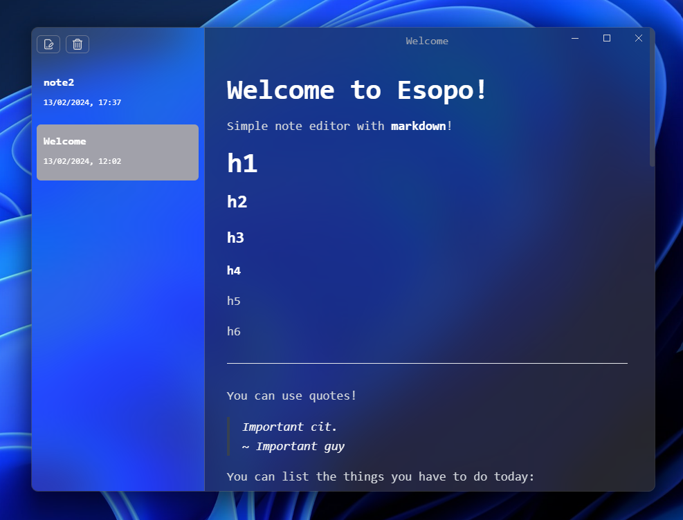

# Esopo Simple Notes

Simple markdown editor made with Electron, React and TypeScript.

It's an interface over a folder of markdown files, following the principle of [file over
app](https://stephango.com/file-over-app).

Features:

- [x] Markdown reader/writer
- [x] Autosave
- [ ] Saving on close
- [ ] Change colors and font to appear more "classy"
- [ ] Git autosync
- [ ] Choose directory / Change directory



## Why the name "_Esopo_"?

I had a book of [Esopo](https://en.wikipedia.org/wiki/Aesop) on my desk when I created this GitHub repo.

This app was my attempt to create a minimalistic markdown note app for windows. Also, I was curious to build something
with Electron.

Huge credits to [Gionatha](https://www.youtube.com/watch?v=t8ane4BDyC8).

:)

## Project Setup

### Install

```bash
$ yarn
```

### Development

```bash
$ yarn dev
```

### Build

```bash
# For windows
$ yarn build:win

# For macOS
$ yarn build:mac

# For Linux
$ yarn build:linux
```

